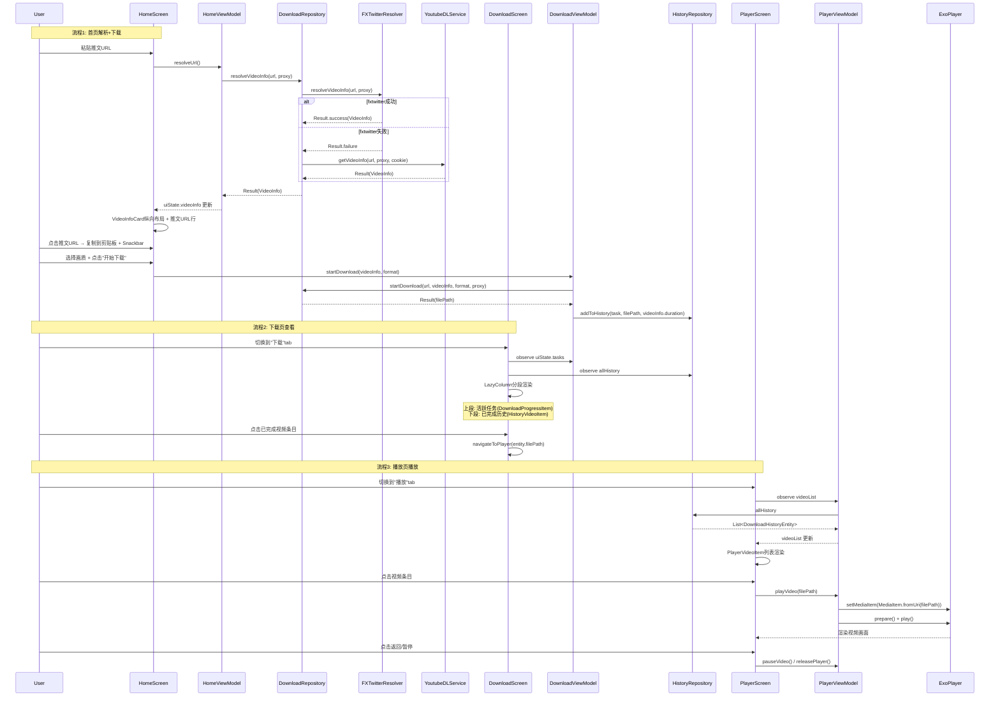
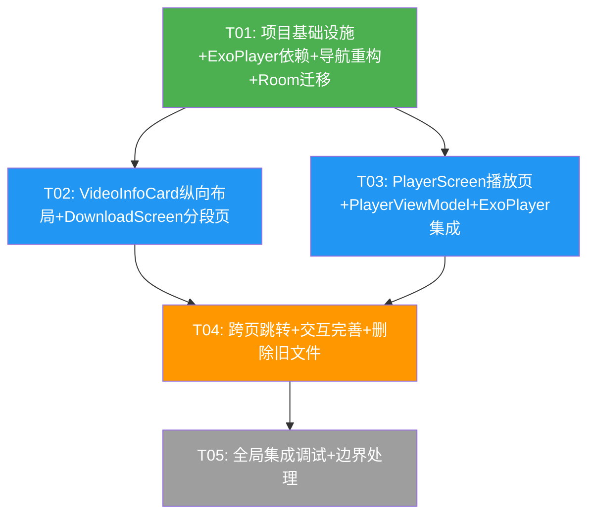

# TwitterDownloader v2 — 系统架构设计 + 任务分解

> 架构师：高见远（Gao） | 基于 PRD-v2.md | 2026-07-01

---

## Part A: 系统设计

### 1. 实现方案 + 框架选型

#### 核心技术挑战

1. **导航重构**：从 首页/队列/历史 → 首页/下载/播放，Screen sealed class、NavHost、BottomBar 全部需要更新
2. **下载页合并**：原 DownloadQueueScreen + HistoryScreen 合并为一个 DownloadScreen，需要在一个 LazyColumn 中分段渲染活跃任务和历史记录
3. **播放页集成**：需要 ExoPlayer 内嵌视频播放，涉及 PlayerScreen UI、PlayerViewModel、ExoPlayer 生命周期管理
4. **VideoInfoCard 布局重构**：从横向 Row → 纵向 Column（缩略图大图 + 下方信息 + 推文URL），需要同时兼容首页和播放页不同使用场景
5. **Room 数据库迁移**：DownloadHistoryEntity 新增 `duration` 字段，数据库版本升级

#### 框架与库选型

| 库 | 版本 | 选型理由 |
|----|------|----------|
| **ExoPlayer (Media3)** | `1.5.1` | 官方推荐的新 Media3 体系，替代旧 `com.google.android.exoplayer:exoplayer`；更好的格式支持、自适应流、手势控制；与 Compose 集成更自然 |
| **Media3 UI module** | `1.5.1` | 提供 `PlayerView` 的 Compose 包装，内含控制栏 UI，减少自定义播放器 UI 工作量 |
| **Room** | `2.6.1` (已有) | 新增 `duration` 字段，使用 `fallbackToDestructiveMigration` |
| **Coil** | `2.7.0` (已有) | 继续用于缩略图加载 |
| **Navigation Compose** | `2.8.5` (已有) | 导航重构，新增 Download/Player 路由 |

#### ExoPlayer 集成方式

采用 **声明式依赖 + Compose 封装** 方式：

- 依赖项：`androidx.media3:media3-exoplayer:1.5.1` + `androidx.media3:media3-ui:1.5.1` + `androidx.media3:media3-common:1.5.1`
- 不使用 `media3-session`（无需后台播放服务）
- 在 PlayerScreen 中通过 `AndroidView` 嵌入 `PlayerView`，ExoPlayer 实例由 PlayerViewModel 管理
- ExoPlayer 实例在 ViewModel `onCleared()` 时释放，避免内存泄漏
- 播放本地文件使用 `MediaItem.fromUri(filePath)`，无需网络 DataSource

#### 架构模式

沿用现有 **MVVM** 架构：
- **View层**：Compose Screen + Component
- **ViewModel层**：HomeViewModel、DownloadViewModel、PlayerViewModel（新增）、HistoryViewModel（复用）
- **Repository层**：DownloadRepository、HistoryRepository（复用）
- **Data层**：Room Database + youtubedl-android + fxtwitter API

---

### 2. 文件列表及相对路径

> N = 新建, M = 修改

```
app/build.gradle.kts                                                   (M)  新增 ExoPlayer 依赖

app/src/main/java/com/ed/twitterdownloader/
├── navigation/
│   └── AppNavigation.kt                                               (M)  Screen sealed class + NavHost + BottomBar 重构
├── data/
│   ├── model/
│   │   └── DownloadHistoryEntity.kt                                   → 不单独修改（Entity 在 database 包下）
│   ├── database/
│   │   ├── DownloadHistoryEntity.kt                                   (M)  新增 duration 字段
│   │   ├── AppDatabase.kt                                             (M)  version=2 + fallbackToDestructiveMigration
│   │   └── DownloadHistoryDao.kt                                      (M)  新增 duration 相关查询（可选）
│   └── repository/
│       ├── HistoryRepository.kt                                       (M)  addToHistory 传入 duration
│       └── DownloadRepository.kt                                      (M)  startDownload 返回 duration（从 VideoInfo 传入）
├── viewmodel/
│   ├── HomeViewModel.kt                                               (M)  无结构变更，但 HomeScreen 调用方式可能微调
│   ├── DownloadViewModel.kt                                           (M)  适配 DownloadScreen 分段 UIState
│   ├── HistoryViewModel.kt                                            (M)  可能被 DownloadViewModel 整合部分逻辑
│   └── PlayerViewModel.kt                                             (N)  ExoPlayer 实例管理 + 播放状态
├── ui/
│   ├── screens/
│   │   ├── HomeScreen.kt                                              (M)  适配新 VideoInfoCard + 推文URL复制
│   │   ├── DownloadQueueScreen.kt                                     → 删除或保留为 DownloadScreen 内部组件
│   │   ├── HistoryScreen.kt                                           → 删除或保留为 DownloadScreen 内部组件
│   │   ├── DownloadScreen.kt                                          (N)  合并队列+历史，分段 LazyColumn
│   │   ├── PlayerScreen.kt                                            (N)  播放页视频列表 + 内嵌播放器
│   │   └── SettingsScreen.kt                                          (—)  不修改
│   ├── components/
│   │   ├── VideoInfoCard.kt                                           (M)  纵向布局 + 推文URL行 + 可点击复制
│   │   ├── DownloadProgressItem.kt                                    (M)  推文URL行（可选）
│   │   ├── HistoryVideoItem.kt                                        (N)  下载页+播放页共享的视频条目组件
│   │   ├── PlayerVideoItem.kt                                         (N)  播放页专用条目（缩略图+播放图标叠加）
│   │   ├── StickySectionHeader.kt                                     (N)  分段标题组件（"正在下载"/"已完成"）
│   │   ├── EmptyState.kt                                              (—)  不修改
│   │   ├── UrlInputBar.kt                                             (—)  不修改
│   │   ├── QualityChipGroup.kt                                        (—)  不修改
│   └── theme/                                                          (—)  不修改
└── MainActivity.kt                                                     (—)  不修改
```

**文件总计**：6 个新建(N) + 9 个修改(M) = 15 个文件需处理

---

### 3. 数据结构和接口（类图）

```mermaid
classDiagram

    %% === Navigation ===
    class Screen {
        <<sealed>>
        route: String
        label: String
        icon: ImageVector
    }
    class HomeScreen_SEALED {
        route = "home"
        label = "首页"
        icon = Icons.Outlined.Home
    }
    class DownloadScreen_SEALED {
        route = "download"
        label = "下载"
        icon = Icons.Outlined.Download
    }
    class PlayerScreen_SEALED {
        route = "player"
        label = "播放"
        icon = Icons.Outlined.SmartDisplay
    }
    class Settings_SEALED {
        route = "settings"
        label = "设置"
        icon = Icons.Outlined.Settings
    }
    Screen <|-- HomeScreen_SEALED : data object
    Screen <|-- DownloadScreen_SEALED : data object
    Screen <|-- PlayerScreen_SEALED : data object
    Screen <|-- Settings_SEALED : data object

    %% === Data Models ===
    class VideoInfo {
        url: String
        title: String
        thumbnail: String
        duration: Long
        uploader: String
        formats: List~VideoFormat~
        durationFormatted: String
        bestFormat: VideoFormat?
    }

    class DownloadTask {
        id: String
        url: String
        title: String
        thumbnail: String
        uploader: String
        formatId: String
        quality: String
        progress: Float
        etaSeconds: Long
        status: DownloadStatus
        outputPath: String
        errorMessage: String
        createdAt: Long
        completedAt: Long?
        progressInt: Int
        isCompleted: Boolean
        isActive: Boolean
    }

    class DownloadStatus {
        <<enumeration>>
        PENDING
        RESOLVING
        DOWNLOADING
        PAUSED
        COMPLETED
        FAILED
        CANCELLED
    }

    class DownloadHistoryEntity {
        <<Entity>>
        id: String PK
        url: String
        title: String
        thumbnail: String
        uploader: String
        quality: String
        filePath: String
        fileSize: Long = 0
        duration: Long = 0  ← NEW
        createdAt: Long
        completedAt: Long
    }

    class VideoFormat {
        formatId: String
        quality: String
        ext: String
        filesize: Long
        vcodec: String
        acodec: String
        fps: Int
        directUrl: String?
        displayText: String
    }

    %% === ViewModel ===
    class DownloadViewModel {
        -downloadRepository: DownloadRepository
        -historyRepository: HistoryRepository
        -proxyPreferences: ProxyPreferences
        -_uiState: MutableStateFlow~DownloadUiState~
        +uiState: StateFlow~DownloadUiState~
        +startDownload(videoInfo, format)
        +cancelDownload(taskId)
        +removeTask(taskId)
        +clearCompleted()
        +getActiveCount(): Int
    }

    class DownloadUiState {
        tasks: List~DownloadTask~
        isDownloading: Boolean
    }

    class PlayerViewModel {
        -historyRepository: HistoryRepository
        -_playerState: MutableStateFlow~PlayerUiState~
        +playerState: StateFlow~PlayerUiState~
        -exoPlayer: ExoPlayer
        +videoList: StateFlow~List~DownloadHistoryEntity~~
        +playVideo(filePath: String)
        +pauseVideo()
        +releasePlayer()
        +onCleared() → releasePlayer()
    }

    class PlayerUiState {
        currentVideo: DownloadHistoryEntity?
        isPlaying: Boolean
        position: Long
        duration: Long
    }

    class HistoryViewModel {
        -repository: HistoryRepository
        +historyList: StateFlow~List~DownloadHistoryEntity~~
        +historyCount: StateFlow~Int~
        +deleteHistory(entity)
        +clearAllHistory()
    }

    %% === Repository ===
    class HistoryRepository {
        -dao: DownloadHistoryDao
        +allHistory: Flow~List~DownloadHistoryEntity~~
        +historyCount: Flow~Int~
        +addToHistory(task, filePath, duration: Long)
        +delete(entity)
        +deleteById(id)
        +clearAll()
    }

    class DownloadRepository {
        -_downloadTasks: MutableStateFlow~List~DownloadTask~~
        +downloadTasks: StateFlow~List~DownloadTask~~
        +outputDir: String
        +resolveVideoInfo(url, proxyUrl): Result~VideoInfo~
        +startDownload(url, videoInfo, format, proxyUrl): Result~String~
        +cancelDownload(taskId)
        +removeTask(taskId)
        +clearCompleted()
    }

    %% === UI Components ===
    class VideoInfoCard_Component {
        <<Composable>>
        +VideoInfoCard(videoInfo: VideoInfo, onUrlClick: (() → Unit)?, modifier: Modifier)
    }

    class StickySectionHeader_Component {
        <<Composable>>
        +StickySectionHeader(title: String, modifier: Modifier)
    }

    class HistoryVideoItem_Component {
        <<Composable>>
        +HistoryVideoItem(entity: DownloadHistoryEntity, onShare: () → Unit, onDelete: () → Unit, onNavigateToPlayer: (() → Unit)?, modifier: Modifier)
    }

    class PlayerVideoItem_Component {
        <<Composable>>
        +PlayerVideoItem(entity: DownloadHistoryEntity, onClick: () → Unit, modifier: Modifier)
    }

    %% === Relationships ===
    DownloadViewModel --> DownloadRepository : uses
    DownloadViewModel --> HistoryRepository : uses
    PlayerViewModel --> HistoryRepository : uses
    PlayerViewModel --> ExoPlayer : manages lifecycle
    HistoryViewModel --> HistoryRepository : uses
    HistoryRepository --> DownloadHistoryDao : uses
    DownloadHistoryEntity --> DownloadHistoryDao : persisted by
    DownloadTask --> DownloadStatus : references
    VideoInfo --> VideoFormat : contains list
```



---

### 4. 程序调用流程（时序图）



---

### 5. Anything UNCLEAR

| # | 问题 | 假设/处理方式 |
|---|------|--------------|
| U1 | DownloadQueueScreen 和 HistoryScreen 是否保留？ | **假设删除**，逻辑全部迁移到 DownloadScreen；但 DownloadProgressItem 组件保留复用 |
| U2 | DownloadScreen 中 HistoryViewModel 是否被 DownloadViewModel 整合？ | **假设独立保留**，DownloadScreen 同时订阅 DownloadViewModel.tasks 和 HistoryViewModel.historyList，避免 ViewModel 过重 |
| U3 | HistoryVideoItem 和 PlayerVideoItem 是否可以合并为一个组件？ | **假设分开**，HistoryVideoItem 有分享/删除按钮，PlayerVideoItem 有播放图标叠加，交互差异足够大 |
| U4 | ExoPlayer 是否需要全屏切换？ | **假设不需要全屏**，播放页内嵌播放即可；如后续需要可加 P2 需求 |
| U5 | 点击下载页已完成视频跳转到播放页自动播放的导航参数传递方式？ | **假设使用 navController.navigate(Player/{filePath})**，通过 route 参数传递 |

---

## Part B: 任务分解

### 6. 依赖包列表

```
# 新增依赖
- androidx.media3:media3-exoplayer:1.5.1      : ExoPlayer 核心播放引擎
- androidx.media3:media3-ui:1.5.1              : ExoPlayer UI 控制栏（PlayerView）
- androidx.media3:media3-common:1.5.1           : ExoPlayer 公共 API

# 已有依赖（不变更）
- io.github.junkfood02.youtubedl-android:library:0.18.1
- io.github.junkfood02.youtubedl-android:ffmpeg:0.18.1
- androidx.compose.* (BOM 2024.12.01)
- androidx.room:room-runtime:2.6.1 / room-ktx:2.6.1 / room-compiler:2.6.1
- androidx.navigation:navigation-compose:2.8.5
- io.coil-kt:coil-compose:2.7.0
- kotlinx-coroutines-android:1.9.0
```

---

### 7. 任务列表（按依赖顺序排列）

#### T01: 项目基础设施 + ExoPlayer依赖 + 导航重构 + Room迁移

| 字段 | 值 |
|------|-----|
| **Task ID** | T01 |
| **Priority** | P0 |
| **Dependencies** | 无（第一个任务） |
| **Source Files** | `app/build.gradle.kts` (M), `navigation/AppNavigation.kt` (M), `data/database/DownloadHistoryEntity.kt` (M), `data/database/AppDatabase.kt` (M), `data/database/DownloadHistoryDao.kt` (M), `data/repository/HistoryRepository.kt` (M), `data/repository/DownloadRepository.kt` (M) |
| **预估改动量** | 中等 |
| **说明** | 1) build.gradle.kts 新增 Media3 三个依赖; 2) Screen sealed class 移除 Queue/History, 新增 Download/Player; 3) screens 列表改为 [Home, Download, Player]; 4) NavHost 新增 Download/Player composable 路由（先占位空 Screen）; 5) DownloadHistoryEntity 新增 `duration: Long = 0` 字段; 6) AppDatabase version=2 + fallbackToDestructiveMigration; 7) HistoryRepository.addToHistory 新增 duration 参数; 8) DownloadRepository.startDownload 传递 videoInfo.duration |

#### T02: VideoInfoCard 纵向布局 + 推文URL行 + DownloadScreen 分段页

| 字段 | 值 |
|------|-----|
| **Task ID** | T02 |
| **Priority** | P0 |
| **Dependencies** | T01 |
| **Source Files** | `ui/components/VideoInfoCard.kt` (M), `ui/screens/HomeScreen.kt` (M), `ui/screens/DownloadScreen.kt` (N), `ui/components/StickySectionHeader.kt` (N), `ui/components/HistoryVideoItem.kt` (N), `viewmodel/DownloadViewModel.kt` (M) |
| **预估改动量** | 较大 |
| **说明** | 1) VideoInfoCard 改为纵向布局：上方缩略图大图(16:9 fillMaxWidth) + 下方信息区(标题/作者/时长/画质) + 推文URL行(primary色可点击复制); 2) 新增 onUrlClick 回调参数; 3) HomeScreen 适配新 VideoInfoCard + 传入 onUrlClick 实现(复制+Snackbar); 4) 新建 DownloadScreen：上方活跃任务段(StickyHeader "正在下载" + DownloadProgressItem列表) + 下方已完成段(StickyHeader "已完成" + HistoryVideoItem列表); 5) 新建 StickySectionHeader 通用分段标题组件; 6) 新建 HistoryVideoItem 复用 HistoryScreen.HistoryItem 但增加 onNavigateToPlayer 回调; 7) DownloadViewModel 添加对 HistoryRepository 的引用，DownloadUiState 扩展 historyList 字段; 8) AppNavigation 中 Download 路由替换为 DownloadScreen |

#### T03: PlayerScreen 播放页 + PlayerViewModel + ExoPlayer集成

| 字段 | 值 | 
|------|-----|
| **Task ID** | T03 |
| **Priority** | P0 |
| **Dependencies** | T01 |
| **Source Files** | `ui/screens/PlayerScreen.kt` (N), `viewmodel/PlayerViewModel.kt` (N), `ui/components/PlayerVideoItem.kt` (N), `navigation/AppNavigation.kt` (M) |
| **预估改动量** | 较大 |
| **说明** | 1) 新建 PlayerViewModel：管理 ExoPlayer 实例(创建/prepare/play/pause/release)、PlayerUiState(currentVideo/isPlaying/position/duration)、videoList 来自 HistoryRepository.allHistory; 2) 新建 PlayerScreen：视频列表区域(PlayerVideoItem列表) + 播放区域(AndroidView嵌套PlayerView); 3) PlayerVideoItem 组件：缩略图+标题+作者+播放图标叠加(Box + Icon overlay); 4) AppNavigation Player 路由替换为 PlayerScreen; 5) ExoPlayer 在 ViewModel onCleared 时释放; 6) 播放页空状态提示 |

#### T04: 下载页→播放页跳转 + 交互完善 + 推文URL复制Snackbar

| 字段 | 值 |
|------|-----|
| **Task ID** | T04 |
| **Priority** | P1 |
| **Dependencies** | T02, T03 |
| **Source Files** | `ui/screens/DownloadScreen.kt` (M), `ui/screens/HomeScreen.kt` (M), `ui/components/VideoInfoCard.kt` (M), `navigation/AppNavigation.kt` (M), `ui/screens/DownloadQueueScreen.kt` (删除), `ui/screens/HistoryScreen.kt` (删除) |
| **预估改动量** | 中等 |
| **说明** | 1) DownloadScreen 中 HistoryVideoItem 点击跳转到播放页(navController.navigate("player/{filePath}")) 并自动播放; 2) PlayerScreen 支持接收 filePath 导航参数自动播放; 3) HomeScreen 推文URL点击复制 + SnackbarHost 实现(ClipboardManager + SnackbarHostState); 4) DownloadScreen TopAppBar 保留"清理已完成"+"清空历史"按钮; 5) 删除旧 DownloadQueueScreen.kt 和 HistoryScreen.kt 文件; 6) 导航参数传递完善 |

#### T05: 全局集成调试 + 边界情况处理

| 字段 | 值 |
|------|-----|
| **Task ID** | T05 |
| **Priority** | P1 |
| **Dependencies** | T04 |
| **Source Files** | `navigation/AppNavigation.kt` (M), `viewmodel/DownloadViewModel.kt` (M), `viewmodel/PlayerViewModel.kt` (M), `ui/screens/DownloadScreen.kt` (M), `ui/screens/PlayerScreen.kt` (M) |
| **预估改动量** | 小 |
| **说明** | 1) 确保三个 tab 切换时 ViewModel 状态正确保持(Shared ViewModel策略); 2) 播放页 ExoPlayer 生命周期与 Compose Lifecycle 对齐(LifecycleEventObserver); 3) 下载页活跃任务为0时隐藏"正在下载"段; 4) 播放页视频文件不存在时的错误处理(File.exists()检查); 5) Room 数据库升级后首次启动验证; 6) 导航参数序列化安全处理 |

---

### 8. 共享知识（跨文件约定）

```
### VideoInfoCard 新布局规范
- 纵向 Column 布局：缩略图大图(fillMaxWidth, aspectRatio=16/9, RoundedCornerShape 12.dp top) → 信息区(padding 12.dp)
- 缩略图使用 ContentScale.Crop
- 推文URL行：primary色文本, 单行Ellipsis截断, 点击触发 onUrlClick 回调
- onUrlClick 默认 null → 不显示URL行（播放页不传此参数）

### Screen 导航约定
- 底部导航3 tab: Home("home") / Download("download") / Player("player")
- Settings 从首页 TopAppBar 进入, 不在 BottomBar 显示
- 跳转播放页自动播放: navController.navigate("player/{filePath}") → PlayerScreen 接收 filePath NavArgument
- Navigation 使用 saveState + restoreState 保证 tab 切换状态保持

### ExoPlayer 实例管理约定
- PlayerViewModel 持有唯一 ExoPlayer 实例
- ExoPlayer 在 ViewModel onCleared() 时 release()
- 播放本地文件: MediaItem.fromUri(Uri.fromFile(File(filePath)))
- 不使用 Service/前台通知, 仅 Activity 内播放
- Compose Lifecycle 对齐: onStop 时 pause, onStart 时 resume

### DownloadScreen 分段约定
- LazyColumn item 顺序: 活跃段(StickyHeader + items) → 已完成段(StickyHeader + items)
- 活跃段数据源: DownloadViewModel.uiState.tasks.filter { it.isActive }
- 已完成段数据源: HistoryViewModel.historyList
- 活跃段为空时隐藏 StickyHeader 和整段

### 推文URL复制约定
- 点击URL → ClipboardManager.setText(AnnotatedString(url))
- 复制后 Snackbar 提示 "已复制链接"
- SnackbarHost 在各 Screen 的 Scaffold 中独立管理
```

---

### 9. 任务依赖图



> **关键路径**：T01 → T02 → T04 → T05（VideoInfoCard + DownloadScreen 为主线）
> **可并行**：T02 和 T03 可同时开发（仅共同依赖 T01）
