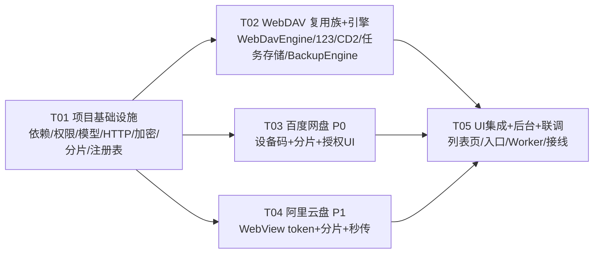

# XInvox 网盘直连备份系统 — 系统设计与任务分解

> 架构师：Bob ｜ 项目：XInvox（com.ed.twitterdownload，Kotlin + Compose）
> 本设计基于现有代码：`WebDavSyncService.kt`、`CloudSyncPreferences.kt`、`SettingsScreen.kt`（下载器）、`AppNav.kt`、`AppNavigation.kt`、`DownloadHistoryEntity.kt`、`AppContainer.kt`、`XInvoxApplication.kt`、`BackgroundSyncScheduler.kt` 等。
> 配套文件：`docs/class-diagram.mermaid`（类图）、`docs/sequence-diagram.mermaid`（时序图）。

---

# Part A：系统设计

## 1. 实现方案与框架选型

### 1.1 难点分析

| 难点 | 说明 | 对策 |
|---|---|---|
| 网盘协议差异大 | 百度走 OAuth 设备码 + PCS 分片；123 走官方 WebDAV；阿里走非官方 refresh_token + openapi 分片/秒传；CD2 走本机 WebDAV | 统一 `BackupTarget` 接口 + 适配器注册表，每种网盘只实现一种授权方式（`AuthMode`）与一种上传路径 |
| 现有 WebDAV 不能推翻重写 | `WebDavSyncService` 是 `object` 静态方法，UI 直接调用；同步逻辑（MKCOL+PUT+HEAD 跳过+BasicAuth）验证过、可复用 | 提取 `WebDavEngine` 核心类，`WebDavSyncService` 保留为薄门面委托；新目标复用同一引擎 |
| 凭证敏感 | access_token / refresh_token / WebDAV 密码都属敏感数据 | EncryptedSharedPreferences（Keystore 主密钥）统一封装 `CredentialStore`；日志脱敏 |
| 大文件分片 + 断点续传 | 百度 PCS superfile、阿里 openapi part 上传各自为政 | 抽象 `ChunkedUploader`（sha1 / 切分 / 进度 / 分片收据落盘），百度/阿里复用；WebDAV 族整文件 PUT 不分片 |
| 后台备份受 Android 12+ 限制 | 后台 startForegroundService 受限 | WorkManager `CoroutineWorker.setForeground()`（work 2.9 支持），配 FGS 权限 + 通知渠道；App 前台时直接进程内跑队列 |
| 任务队列/重试/状态机要共用 | 不能为每个网盘各写一套备份逻辑 | 单一 `BackupEngine`：队列 + 状态机 + 指数退避重试，与目标无关 |

### 1.2 框架选型

| 关注点 | 选择 | 理由 |
|---|---|---|
| WebDAV 传输 | **保留 HttpURLConnection**（提取为 `WebDavEngine`） | 现有代码已验证，避免回归；`WebDavSyncService` 改动最小 |
| 百度/阿里 HTTP | **okhttp 4.12.0**（显式声明） | Coil 已传递依赖 okhttp，显式声明成本低；JSON/预签名 PUT/流式上传比 HttpURLConnection 简洁可靠 |
| JSON 序列化 | kotlinx-serialization-json 1.7.1（已有） | 零新增 |
| 凭证加密 | `androidx.security:security-crypto:1.1.0-alpha06`（EncryptedSharedPreferences） | Keystore 主密钥 + AES；Google 已标记维护模式但功能稳定，是当前最小成本方案（若团队顾虑可在 T01 落地时改用 Tink 手工 Keystore，接口不变） |
| 后台任务 | `androidx.work:work-runtime-ktx:2.9.0`（已有）+ `setForeground()` | 沿用现有 `BackgroundSyncScheduler` 模式（XInvoxApplication collect flow → scheduler） |
| 任务持久化 | **JSON 文件**（filesDir，kotlinx-serialization） | 任务队列是易失性中间数据，可重建；避免 Room schema 升级（当前 XInvoxDatabase version=4） |
| 架构模式 | 接口抽象 + 手动 DI（沿用 `AppContainer`） | 与现有代码风格一致，不引入 Hilt |
| UI | Compose + 现有 GlassSurface/EdqiuIcons/StatusBadge | 复用现有组件，视觉一致 |

### 1.3 核心抽象

```kotlin
// backup/model/BackupTarget.kt（接口签名，示意）
interface BackupTarget {
    val id: String                 // "webdav" | "baidu" | "pan123" | "aliyun" | "clouddrive2"
    val displayName: String        // 用户可见名称
    val authMode: AuthMode         // DEVICE_CODE_QR / WEBDAV_CREDENTIAL / WEBVIEW_TOKEN / NONE
    val capabilities: BackupCapabilities

    suspend fun isConfigured(): Boolean      // 凭证是否已填（可发起授权）
    suspend fun isAuthorized(): Boolean      // 是否已获得有效 token/凭据
    suspend fun prepareRemote(): Result<Unit>          // 建目录（MKCOL / mkdir / 确保 /apps/XInvox）
    suspend fun exists(remotePath: String): Result<Boolean>
    suspend fun uploadFile(local: File, remotePath: String, progress: (Float) -> Unit): Result<UploadReceipt>
    suspend fun testConnection(): Result<Unit>
}
```

- **备份目标（BackupTarget）**：一个网盘 = 一个适配器 = 一个 `BackupTarget` 实现。
- **WebDAV（高级）**：`WebDavBackupTarget`，保留现有配置 UI（`CloudSyncPreferences`），在网盘直连列表中标「高级/自定义」。
- **注册表（ProviderRegistry）**：id → 适配器单例；`AppContainer` 统一构造注入；CD2 走 `detectCloudDrive2()` 探测。

### 1.4 各适配器要点

| 适配器 | 授权方式 | 上传方式 | 关键约束 |
|---|---|---|---|
| `BaiduPanTarget` | DEVICE_CODE_QR：WebView 展示二维码 → 轮询换 token | PCS superfile2 分片（默认 4MB，大文件自动升分片），**固定目录 `/apps/XInvox`** | access_token 约 30 天，refresh_token 约 10 年；需要已注册的 client_id/client_secret（见待明确事项） |
| `Pan123Target` | WEBDAV_CREDENTIAL：引导用户生成应用密码，自动填 `https://webdav-{账号id}.pd1.123pan.cn/webdav` | 复用 `WebDavEngine`，整文件 PUT，不分片 | accountId 用于拼 URL，缺失时允许用户粘贴完整地址兜底 |
| `AliPanTarget` | WEBVIEW_TOKEN：WebView 打开 aliyundrive.com 截取 refresh_token（约 90 天）+ 自动刷新；TOKEN_PASTE 兜底 | openapi 分片（默认 10MB）+ sha1 秒传 | 秒传：create 带 `content_hash`，`exist=true` 直接完成 |
| `CloudDrive2Target` | NONE：探测 `127.0.0.1:19798`，一键填充 | 复用 `WebDavEngine` | 探测用 OPTIONS/PROPFIND；用户名密码由用户在 CD2 设置里配置（可能为空） |
| `WebDavBackupTarget` | WEBDAV_CREDENTIAL（现有配置） | 复用 `WebDavEngine` | 标记「高级」，保留 `webDavProviders` 预设（123 预设 URL 需按新方案更新） |

### 1.5 凭证安全存储

```kotlin
interface CredentialStore {
    fun save(providerId: String, values: Map<String, String>)
    fun read(providerId: String): Map<String, String>
    fun clear(providerId: String)
}
class EncryptedCredentialStore(context: Context) : CredentialStore { /* EncryptedSharedPreferences */ }
```

- 每个 provider 独立命名空间（如 `baidu`、`aliyun`、`pan123`）。
- 百度存：`access_token` / `refresh_token` / `expires_at`；阿里存：`refresh_token` / `access_token` / `expires_at`；123/CD2/WebDAV 存：`server_url` / `username` / `password`。
- **迁移策略**：现有 WebDAV 密码仍在 `CloudSyncPreferences`（明文 SharedPreferences），本版本不强制迁移（标记技术债）；新增网盘一律走加密存储。日志与错误信息一律脱敏（token/密码打 `***`）。

### 1.6 后台备份（WorkManager + 前台服务）

- `BackupWorker : CoroutineWorker`：`setForeground()` 展示进度通知（需 `FOREGROUND_SERVICE`、`FOREGROUND_SERVICE_DATA_SYNC`(API34+)、`POST_NOTIFICATIONS`(API33+ 运行时申请) + 通知渠道）。
- `BackupScheduler`：`scheduleOnce()`（下载完成/手动触发）、`schedulePeriodic()`（可选 15min 对齐现有 `BackgroundSyncScheduler` 模式）、`cancel()`。
- **前台直跑**：用户停留在 App 内时（手动立即备份、下载完成后入队），由 `CloudBackupViewModel` 直接调 `BackupEngine.runQueue()`，不走 Worker（与现有 WebDAV 行为一致，低延迟、进度实时）。
- **触发源**：① 手动「立即备份」；② 下载完成后（`YoutubeDLService`/`DirectDownloader` 完成后入队，若 autoBackup 开启）；③ WorkManager 定时兜底（网络可用时）。
- 注意：`XInvoxApplication` 现有两个 scheduler flow collect 模式可直接复制给 `BackupScheduler`。

### 1.7 分片上传抽象

```kotlin
class ChunkedUploader {
    suspend fun computeSha1(file: File): String
    fun split(file: File, chunkSize: Long): List<Chunk>          // Chunk(seq, offset, length, bytes lazy)
    suspend fun uploadChunks(
        chunks: List<Chunk>,
        uploader: suspend (Chunk) -> Result<String>,             // 返回分片收据（md5/etag）
        resumeState: MutableMap<Int, String>,                    // seq -> 收据；续传时跳过已确认分片
        progress: (Long) -> Unit
    ): Result<Unit>
}
```

- 断点续传：分片收据随任务 `bytesDone` 一起落盘到 `BackupTaskStore`；重试时 `resumeState` 已确认的分片直接跳过，只有最后一步（百度 `create` / 阿里 `complete`）是原子操作。
- 阿里续传额外支持 `listUploadedParts` 拉取服务端已上传分片，兜底本地状态丢失。
- 分片大小：百度 4MB（PCS 分片数上限约 1024，>4GB 文件自动升 32MB）；阿里 10MB（上限 10000 片，覆盖 ~97GB）。

## 2. 文件列表

> 新增包：`com.ed.xinvox.backup`（网盘直连核心）+ `com.ed.xinvox.ui.backup`（UI）。所有相对路径基于 `app/src/main/java/`。

### 新增文件

| # | 相对路径 | 职责 |
|---|---|---|
| N1 | `com/ed/xinvox/backup/model/BackupTarget.kt` | `BackupTarget` 接口、`AuthMode`、`BackupCapabilities`、`UploadReceipt`、`ProviderId` 常量 |
| N2 | `com/ed/xinvox/backup/model/BackupTask.kt` | `BackupTask` 数据类、`BackupTaskStatus` 枚举、`BackupSummary` |
| N3 | `com/ed/xinvox/backup/http/HttpClient.kt` | okhttp 封装：getJson/postJson/putStream(head/options)，超时与重试 |
| N4 | `com/ed/xinvox/backup/data/BackupCredentialStore.kt` | `CredentialStore` 接口 + `EncryptedCredentialStore`（EncryptedSharedPreferences） |
| N5 | `com/ed/xinvox/backup/data/BackupTaskStore.kt` | `BackupTaskStore` 接口 + `JsonBackupTaskStore`（filesDir JSON + Mutex + StateFlow） |
| N6 | `com/ed/xinvox/backup/upload/ChunkedUploader.kt` | sha1/切分/分片上传/进度/续传状态 |
| N7 | `com/ed/xinvox/backup/provider/WebDavEngine.kt` | 从 `WebDavSyncService` 提取的 WebDAV 核心（MKCOL/HEAD/PUT/OPTIONS + BasicAuth + 目录逐级创建） |
| N8 | `com/ed/xinvox/backup/provider/WebDavBackupTarget.kt` | 现有 WebDAV 适配（高级），委托 `WebDavEngine` + `CloudSyncPreferences` |
| N9 | `com/ed/xinvox/backup/provider/Pan123Target.kt` | 123 网盘：URL 构建（`webdav-{accountId}.pd1.123pan.cn`）+ 复用 WebDavEngine |
| N10 | `com/ed/xinvox/backup/provider/CloudDrive2Target.kt` | CD2：127.0.0.1:19798 探测 + 一键填充 |
| N11 | `com/ed/xinvox/backup/provider/ProviderRegistry.kt` | 适配器注册表 + `detectCloudDrive2()` |
| N12 | `com/ed/xinvox/backup/provider/BaiduPanApi.kt` | 百度 PCS API 客户端（superfile 会话/分片/合并/meta） |
| N13 | `com/ed/xinvox/backup/provider/BaiduPanTarget.kt` | 百度适配器：设备码授权编排 + 分片上传 + token 管理 |
| N14 | `com/ed/xinvox/backup/provider/AliPanApi.kt` | 阿里 openapi 客户端（access_token/create/uploadPart/listUploadedParts/complete） |
| N15 | `com/ed/xinvox/backup/provider/AliPanTarget.kt` | 阿里适配器：WebView 授权 + 分片 + sha1 秒传 + token 自动刷新 |
| N16 | `com/ed/xinvox/backup/auth/BaiduDeviceCodeAuth.kt` | 百度设备码授权客户端（requestDeviceCode / pollToken） |
| N17 | `com/ed/xinvox/backup/auth/AliPanWebViewAuth.kt` | 阿里 WebView 截取（localStorage/URL）+ 手动粘贴回调 |
| N18 | `com/ed/xinvox/backup/engine/BackupEngine.kt` | 队列/状态机/指数退避重试/进度 StateFlow |
| N19 | `com/ed/xinvox/backup/engine/BackupWorker.kt` | WorkManager Worker + `BackupScheduler`（scheduleOnce/Periodic/cancel + setForeground 通知） |
| N20 | `com/ed/xinvox/ui/backup/CloudBackupScreen.kt` | 网盘直连列表页：目标卡片（状态/授权/立即备份/任务进度） |
| N21 | `com/ed/xinvox/ui/backup/CloudBackupViewModel.kt` | 页面 VM：targets 状态 + tasks 流 + startAuth/backupNow/cancel |
| N22 | `com/ed/xinvox/ui/backup/BaiduAuthDialog.kt` | 百度二维码授权弹窗（WebView 展示二维码 + 轮询） |
| N23 | `com/ed/xinvox/ui/backup/AliAuthDialog.kt` | 阿里授权弹窗（WebView 登录/截取 + 手动粘贴 refresh_token） |

### 修改文件

| # | 相对路径 | 改动 |
|---|---|---|
| M1 | `app/build.gradle.kts` | + `okhttp:okhttp:4.12.0`、`androidx.security:security-crypto:1.1.0-alpha06` |
| M2 | `app/src/main/AndroidManifest.xml` | + `FOREGROUND_SERVICE`、`FOREGROUND_SERVICE_DATA_SYNC`、`POST_NOTIFICATIONS` 权限（通知渠道在 Worker 内建） |
| M3 | `com/ed/twitterdownloader/service/WebDavSyncService.kt` | 改为委托 `WebDavEngine` 的薄门面，**保持 `syncDownloads(context, prefs)` 签名不变**（SettingsScreen 旧调用零改动） |
| M4 | `com/ed/xinvox/di/AppContainer.kt` | 构造 `EncryptedCredentialStore`、`JsonBackupTaskStore`、`ProviderRegistry`、`BackupEngine`；暴露给 VM |
| M5 | `com/ed/xinvox/di/XInvoxViewModelFactory.kt` | `CloudBackupViewModel` 工厂参数注入 |
| M6 | `com/ed/twitterdownloader/navigation/AppNavigation.kt` | `Screen.CloudBackup` 二级路由 + `MineNav.openCloudBackup` |
| M7 | `com/ed/xinvox/ui/navigation/AppNav.kt` | 我的页「下载器」分组新增「网盘备份」入口行 → `openCloudBackup`；`CloudBackupScreen` 挂到二级路由 |
| M8 | `com/ed/twitterdownloader/ui/screens/WebDavProviderSelector.kt` | 123 预设 URL 更新为 `webdav-{id}.pd1.123pan.cn` 说明（可选，P0 内顺手改） |

## 3. 数据结构和接口（类图）

见 `docs/class-diagram.mermaid`。要点：

- `BackupTarget` 为唯一上传抽象；5 个实现（WebDAV 族 3 个 + 百度 + 阿里）。
- `BackupEngine` 依赖 `BackupTaskStore`（持久化）、`ProviderRegistry`（取目标）、`CredentialStore`（取 token）；对外暴露 `StateFlow<BackupUiState>`。
- `BackupTask` 是队列最小单元：`taskId = sha256(targetId + "|" + remotePath)`（幂等去重），`status` 状态机 `PENDING → UPLOADING → DONE | FAILED`（重试回到 PENDING）。
- 百度/阿里各持 `XxxPanApi`（纯 API 客户端，只做 HTTP）+ `XxxPanTarget`（编排/状态）；两者共用 `ChunkedUploader`。
- `WebDavEngine` 被 `WebDavBackupTarget` / `Pan123Target` / `CloudDrive2Target` 复用，同时被 `WebDavSyncService` 门面委托。

## 4. 程序调用流程（时序图）

见 `docs/sequence-diagram.mermaid`，覆盖三个关键流程：

1. **百度设备码授权**：点击登录 → 请求 device code → WebView 展示二维码 → 轮询（interval）→ 用户扫码确认 → 换取 access/refresh token → 加密存储。
2. **阿里 token 获取与刷新**：WebView 登录 → 截取 refresh_token（失败则手动粘贴兜底）→ 换 access_token → 存储；上传前 `ensureAccessToken()` 校验过期自动刷新。
3. **备份任务执行**：runQueue → prepareRemote → 逐任务 exists 跳过/上传（分片 or 整文件）→ 分片收据落盘续传 → complete → 更新状态；失败指数退避重试，耗尽置 FAILED。

## 5. 待明确事项（设计缺口）

1. **百度 client_id / client_secret**：设备码流程必须注册百度开放平台应用。需要产品确认：注册自有应用并内置密钥（有泄露/审核风险），还是使用社区公开 client_id（如 alist 所用，稳定性不可控）。设计按「常量/`BuildConfig` 可替换」实现。
2. **阿里 client_id**：非官方 refresh_token 流程需要公开放平台的 client_id（社区常用固定值）。同上需要确认取值来源。
3. **123 网盘 accountId 自动填充**：`https://webdav-{账号id}.pd1.123pan.cn/webdav` 中的 accountId 无法从手机号推导。设计采用「可选填 accountId 自动拼 URL；不填则用户从 123 设置页粘贴完整 WebDAV 地址」双通道。是否接受？
4. **minSdk/targetSdk 出入**：任务简报写 minSdk 26 / targetSdk 35，但 `app/build.gradle.kts` 实际是 minSdk 24 / targetSdk 34 / compileSdk 35。设计按 minSdk 26 兼容（EncryptedSharedPreferences 需 23+，无冲突），但需确认是否顺带升 targetSdk 35（涉及 FGS 权限 `FOREGROUND_SERVICE_DATA_SYNC` 声明）。
5. **自动备份触发策略**：下载完成后自动入队默认开还是关？是否保留 WorkManager 定时兜底（15min 与现有 `backgroundSyncFlow` 对齐）？建议默认「手动 + 下载完成后入队（autoBackup 开关，默认关）」，定时兜底暂不加，避免重复上传打扰。
6. **WebDAV 密码迁移**：现有明文密码是否迁移到 `EncryptedCredentialStore`？建议本版本不迁移（只读兼容），下版本统一。
7. **任务存储选型**：设计选 JSON 文件避免 Room 升级（version=4）。若团队希望任务可 SQL 查询/统计，可改为 Room 新表 + Migration(4→5)，工作量约 +0.5 天。
8. **阿里 WebView 截取可靠性**：aliyundrive.com 页面结构变动可能导致截取失败。设计已含 TOKEN_PASTE 兜底；是否接受「自动截取失败时引导手动复制粘贴」为最终体验？

---

# Part B：任务分解

## 6. 依赖包列表（app/build.gradle.kts 新增）

```
com.squareup.okhttp3:okhttp@^4.12.0: 百度/阿里 JSON API 与流式上传（Coil 已传递依赖，显式声明）
androidx.security:security-crypto@1.1.0-alpha06: EncryptedSharedPreferences 凭证加密（Keystore 主密钥）
```

已有无需新增：`androidx.work:work-runtime-ktx:2.9.0`、`kotlinx-serialization-json:1.7.1`、`kotlinx-coroutines-android:1.9.0`、`androidx.room` 系列、Compose BOM。

## 7. 任务列表（按依赖顺序，P0 先行）

### T01 项目基础设施（P0）
- **职责**：依赖声明 + 权限清单 + 核心模型 + HTTP 封装 + 凭证加密 + 通用分片器 + 注册表骨架。
- **源文件**：`app/build.gradle.kts`(M1)、`app/src/main/AndroidManifest.xml`(M2)、`backup/model/BackupTarget.kt`(N1)、`backup/model/BackupTask.kt`(N2)、`backup/http/HttpClient.kt`(N3)、`backup/data/BackupCredentialStore.kt`(N4)、`backup/upload/ChunkedUploader.kt`(N6)、`backup/provider/ProviderRegistry.kt`(N11，先建常量+骨架)
- **依赖**：无
- **验收**：`HttpClient` 可 GET/POST JSON 与流式 PUT；`EncryptedCredentialStore` 加解密可用；`ChunkedUploader` 单测通过（sha1/切分/续传跳过）；模型与状态枚举定义完整；工程可编译。

### T02 WebDAV 复用族 + 备份引擎（P0）
- **职责**：提取 `WebDavEngine`，把现有 WebDAV / 123 / CD2 接入统一 `BackupTarget`；实现任务存储与 `BackupEngine` 状态机（先让 WebDAV 族跑通整条链路）。
- **源文件**：`backup/provider/WebDavEngine.kt`(N7)、`backup/provider/WebDavBackupTarget.kt`(N8)、`backup/provider/Pan123Target.kt`(N9)、`backup/provider/CloudDrive2Target.kt`(N10)、`backup/data/BackupTaskStore.kt`(N5)、`backup/engine/BackupEngine.kt`(N18)、`service/WebDavSyncService.kt`(M3)
- **依赖**：T01
- **验收**：旧 `WebDavSyncService.syncDownloads` 行为不变（回归测试）；手动「立即备份」经 `BackupEngine` 走通 WebDAV；123 URL 构建与 CD2 127.0.0.1:19798 探测可用；任务状态持久化/重启恢复可用。

### T03 百度网盘直连（P0）
- **职责**：设备码扫码授权 + PCS 分片上传（断点续传）+ 授权 UI 弹窗。
- **源文件**：`backup/provider/BaiduPanApi.kt`(N12)、`backup/provider/BaiduPanTarget.kt`(N13)、`backup/auth/BaiduDeviceCodeAuth.kt`(N16)、`ui/backup/BaiduAuthDialog.kt`(N22)
- **依赖**：T01（复用 `ChunkedUploader`/`HttpClient`/`CredentialStore`；与 T02 并行，T05 统一接线）
- **验收**：二维码展示与轮询换 token 成功；上传到 `/apps/XInvox`；>4MB 文件分片成功；模拟断网后重试续传（已传分片跳过）。

### T04 阿里云盘直连（P1）
- **职责**：WebView 截取 refresh_token（+粘贴兜底）+ openapi 分片 + sha1 秒传 + token 自动刷新 + 授权 UI 弹窗。
- **源文件**：`backup/provider/AliPanApi.kt`(N14)、`backup/provider/AliPanTarget.kt`(N15)、`backup/auth/AliPanWebViewAuth.kt`(N17)、`ui/backup/AliAuthDialog.kt`(N23)
- **依赖**：T01（并行于 T02/T03）
- **验收**：WebView 登录截取 refresh_token（失败走粘贴）；秒传命中（重复文件 0 上传）；分片上传与续传；token 过期自动刷新。

### T05 UI 集成 + 后台任务 + 联调（P0）
- **职责**：网盘直连列表页 + 我的页入口 + 二级路由 + WorkManager 后台备份 + 全部适配器注册接线 + 端到端联调。
- **源文件**：`ui/backup/CloudBackupScreen.kt`(N20)、`ui/backup/CloudBackupViewModel.kt`(N21)、`backup/engine/BackupWorker.kt`(N19)、`navigation/AppNavigation.kt`(M6)、`ui/navigation/AppNav.kt`(M7)、`di/AppContainer.kt`(M4)、`di/XInvoxViewModelFactory.kt`(M5)、`ui/screens/WebDavProviderSelector.kt`(M8，123 预设文案)
- **依赖**：T02、T03、T04
- **验收**：我的页 →「网盘备份」进入列表页，5 个目标卡片状态正确；百度/123/阿里全链路可授权可备份；后台 Worker 触发时前台通知展示进度；手动/后台互斥（同一任务不并发）；回归（下载器设置、收件箱设置入口不破）。

## 8. 共享知识（跨文件约定）

- **Provider id 常量**：`ProviderId.WEBDAV="webdav"`、`BAIDU="baidu"`、`PAN123="pan123"`、`ALIYUN="aliyun"`、`CLOUDDRIVE2="clouddrive2"`。
- **远程目录约定**：百度固定 `/apps/XInvox`（`capabilities.fixedRemoteRoot`，忽略用户 remotePath）；123/WebDAV/CD2 用 `remotePath`（默认 `XInvox`）。
- **任务状态机**：`PENDING → UPLOADING → DONE | FAILED`；重试 `FAILED→PENDING(attempt+1)`；`taskId = sha256(targetId + "|" + remotePath)` 去重幂等。
- **返回约定**：所有 provider/engine 方法返回 `Result<T>`；`errorMessage` 面向用户、中文、不包含敏感字段（token/密码一律 `***` 脱敏）。
- **重试策略**：指数退避 30s / 2m / 10m，单任务最多 5 次（`BackupCapabilities.maxRetry`），超限置 FAILED。
- **并发约定**：所有长操作 `suspend` + `Dispatchers.IO`；`BackupEngine` 单队列串行（`Mutex`），同一任务不并发；UI 只读 `StateFlow`，不直接调 provider。
- **进度约定**：`progress: (Float) -> Unit`，0..1；分片上传按字节累计上报；`bytesDone` 随任务落盘，供续传与 UI 恢复。
- **加密存储 key 命名**：`{providerId}_access_token` / `{providerId}_refresh_token` / `{providerId}_expires_at` / `{providerId}_server_url` / `{providerId}_username` / `{providerId}_password`。
- **后台任务**：`BackupWorker` 必须尽快 `setForeground()`（WorkManager 前台时限）；通知渠道 `backup_progress`；API 34+ 需 `FOREGROUND_SERVICE_DATA_SYNC`；`POST_NOTIFICATIONS` 运行时申请失败时静默降级为不展示通知（任务照跑）。
- **网络**：WebDAV 族沿用 HttpURLConnection；百度/阿里走 `HttpClient`(okhttp)。超时统一 connect 20s / read 30s（与现有 WebDavSyncService 一致）。
- **DI**：单例统一挂 `AppContainer`（`credentialStore`、`taskStore`、`registry`、`engine`），VM 经 `XInvoxViewModelFactory` 注入，不引入新 DI 框架。

## 9. 任务依赖图



> 说明：T02/T03/T04 并行（均只依赖 T01），最大化利用人力；T05 最后统一接线与联调。P0 交付 = T01+T02+T03+T05（百度+123 可用）；T04（阿里）为 P1，若排期紧张可延后至下一迭代，T05 对未注册的适配器自动隐藏入口。
